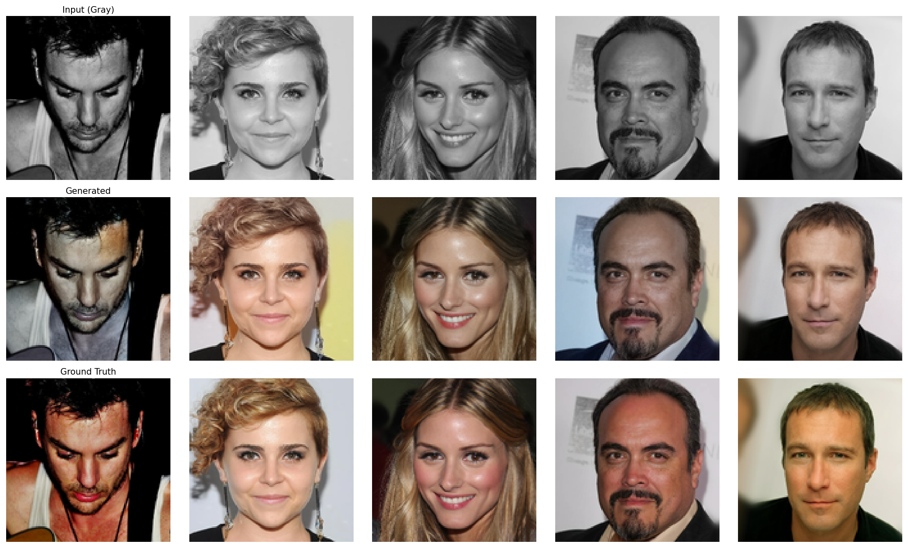

# Conditional Diffusion for Grayscale Image Colorization

A U-Net based diffusion model that colorizes grayscale face images from the CelebA-HQ dataset. The grayscale image is used as a conditioning signal by concatenating it as an additional channel to the noisy RGB image during training.

## Installation

Requires [uv](https://github.com/astral-sh/uv).

```bash
git clone https://github.com/kjyothiswaroop/Conditional-Diffusion-for-Grayscale-Image-Colorization.git
cd Conditional-Diffusion-for-Grayscale-Image-Colorization
uv sync
source .venv/bin/activate
```

Authenticate before running:

```bash
hf auth login   # read token from huggingface.co/settings/tokens
wandb login             # API key from wandb.ai/settings
```

## How to Run

**Training**

```bash
python src/train.py
```

Hyperparameters live in `configs/config.yaml` and can be overridden from the CLI (Hydra):

```bash
python src/train.py lr=0.0001 batch_size=64 resume=true
```

**Inference (Gradio UI)**

```bash
python src/eval.py
```

Upload a grayscale image, adjust diffusion steps and number of samples, and view colorized outputs. Requires `checkpoints/latest.pt`.

## Results



## Extra Criteria

**MLOps — Hydra:** All hyperparameters are managed via `configs/config.yaml` and overridable from the CLI, making every run fully reproducible without touching source code.

**Tracking — Weights & Biases:** Per-step loss, per-epoch loss, and sample image grids (gray / generated / ground truth) are logged to wandb every 10 epochs.

**GUI — Gradio:** Interactive web UI for inference — no code required. Users upload a grayscale image and get colorized outputs directly in the browser.

## Issues

**EMA Network — BatchNorm buffers not copied.**
The EMA network exponentially averages the live UNet's weights after each step. However, BatchNorm layers also hold *buffers* (running mean/variance) that are not parameters and not touched by `model.parameters()`. These were never copied into the EMA network, so it computed fresh batch statistics on every inference call instead of using the accumulated training stats — causing degraded outputs regardless of training length.

Fix: explicitly copy buffers alongside the weight averaging each step:

```python
for buffer, ema_buffer in zip(self.unet.buffers(), self.ema_network.buffers()):
    ema_buffer.copy_(buffer)
```

## Docs

```bash
uv sync --extra docs
make html
# open build/html/index.html
```

## How I Generated the Dataset

Source: `korexyz/celeba-hq-256x256` (CelebA-HQ at 256×256). Each sample is resized to 128×128 with a paired grayscale version and pushed to HuggingFace.

```bash
hf auth login   # write access required
python scripts/generate_dataset.py \
  --source-repo korexyz/celeba-hq-256x256 \
  --output-repo <your-hf-username>/celebahq-128-gray
```

| Split | Samples |
|---|---|
| Train | 28,000 |
| Validation | 1,000 |
| Test | 1,000 |
